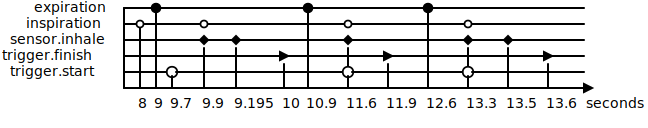

# Mechanical Lung Ventilator specification

Specification is in file [mlv.mrtccsl](), auxiliary macros are in [mutex.mrtccsl]() and [between.mrtccsl]().

Important mentions of syntax are in the [syntax](syntax.md) file. Simulation is implemented in [bin/mlv.ml](bin/mlv.ml) and produces trace

Uses [MRTCCSL](https://github.com/PaulRaUnite/mrtccsl) to describe the [use case](https://github.com/foselab/abz2024_casestudy_MLV/blob/52c618e676a808592e4c92dc950e7629bb0eb67d/Mechanical_Lung_Ventilator%201_5.pdf) for [ABZ 2024](https://abz-conf.org/site/2024/casestudy/) conference.

SVG file is generated using [svgbob](https://github.com/ivanceras/svgbob/).

